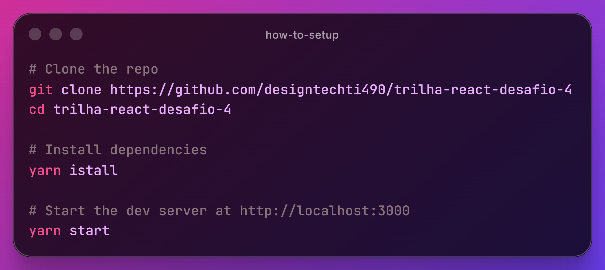

# Challenge #04 - Login

A modern and responsive **login form** project, developed with React, TypeScript, and real-time validation using React Hook Form and Yup.

## 📋 Project Description

This project implements a login page with robust form validation. The user can enter email and password, with automatic validations that block the submit button until all fields are valid.

## ✨ Features

- ✅ **Real-Time Validation** - Validates email and password as the user types.
- ✅ **Custom Error Messages** - Clear feedback on validation errors.
- ✅ **Smart Button** - Automatically blocked when errors occur
- ✅ **Reusable Components** - Customizable and typed Button and Input components
- ✅ **TypeScript** - Type safety throughout the project
- ✅ **Styled Components** - Modular and dynamic styling
- ✅ **Responsive** - Adaptable design for different screen sizes

## 🔐 Validations Implemented

- **Email**: Email format validation and required field
- **Password**: Minimum of 6 characters and required field
- **Button**: Disabled while there are validation errors

## 🛠️ Technologies

&nbsp;
&nbsp;
&nbsp;

## 🚀 How to Setup

## 👤 Author

<table width="100%">

<tr>

<td align="center">

<a href="https://github.com/designtechti490">

 

<b>Marcelo Junior</b>
          <i>Front End Developer</i>

</a>

</td>

</tr>

</table>

---

 Developed with 💜 during the React trail at Digital Innovation One. 

